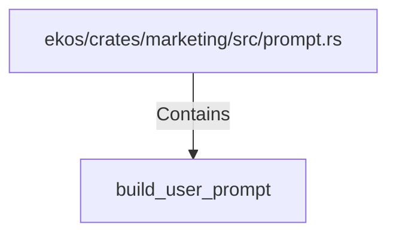

# build_user_prompt (RustSymbol)

## Properties

| Key | Value |
|---|---|
| `kind` | function |

## Relationships

### Contains

- ← ekos/crates/marketing/src/prompt.rs (`49e3daf4-be3b-5889-a66e-372e8980f187`)

## Diagram

## Evidence

_No evidence cited._
