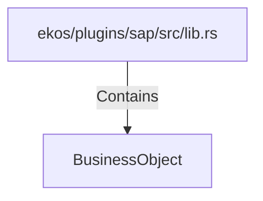

# BusinessObject (RustSymbol)

## Properties

| Key | Value |
|---|---|
| `kind` | struct |

## Relationships

### Contains

- ← ekos/plugins/sap/src/lib.rs (`8ce136d7-2eb9-53fd-90c2-7d0d00aeb27d`)

## Diagram

## Evidence

_No evidence cited._
