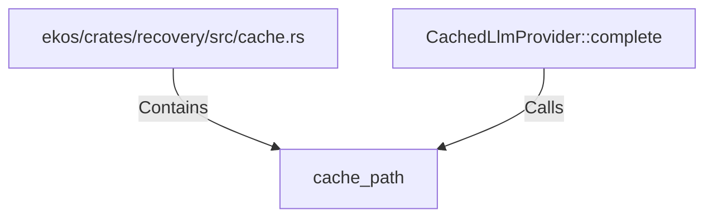

# cache_path (RustSymbol)

## Properties

| Key | Value |
|---|---|
| `kind` | function |

## Relationships

### Calls

- ← CachedLlmProvider::complete (`a17b9530-2256-592a-8e82-2db4eb42b103`)

### Contains

- ← ekos/crates/recovery/src/cache.rs (`0b06681a-4e07-5e02-a8d6-433ccf4aadc4`)

## Diagram

## Evidence

_No evidence cited._
