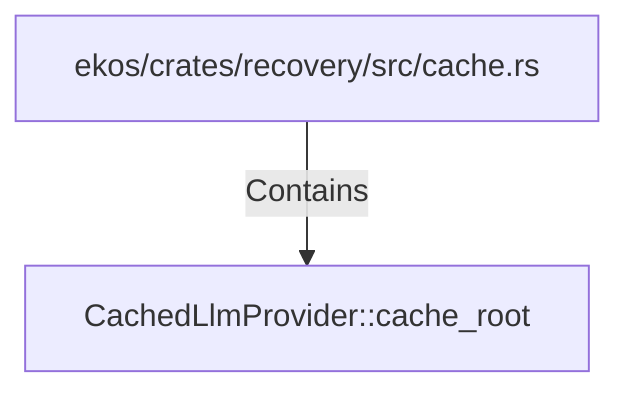

# CachedLlmProvider::cache_root (RustSymbol)

## Properties

| Key | Value |
|---|---|
| `kind` | method |

## Relationships

### Contains

- ← ekos/crates/recovery/src/cache.rs (`0b06681a-4e07-5e02-a8d6-433ccf4aadc4`)

## Diagram

## Evidence

_No evidence cited._
