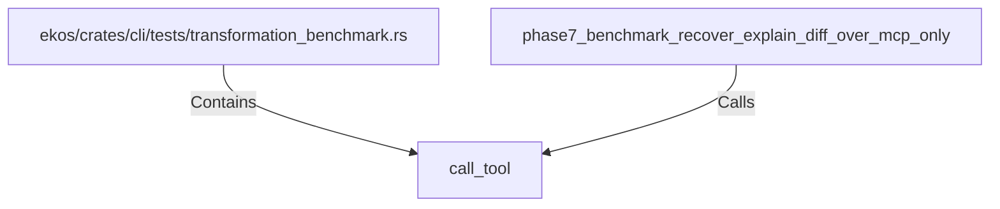

# call_tool (RustSymbol)

## Properties

| Key | Value |
|---|---|
| `kind` | function |

## Relationships

### Calls

- ← phase7_benchmark_recover_explain_diff_over_mcp_only (`145f01d3-4073-53ca-a5a6-0bd6ebdbdb45`)

### Contains

- ← ekos/crates/cli/tests/transformation_benchmark.rs (`6f5dc4e7-3ce8-5dd3-ad8f-f66bbb5fabf5`)

## Diagram

## Evidence

_No evidence cited._
