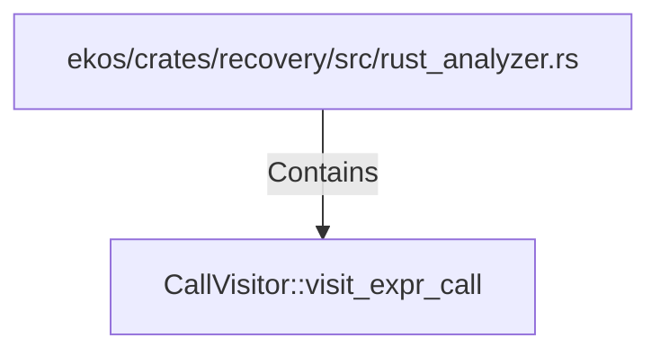

# CallVisitor::visit_expr_call (RustSymbol)

## Properties

| Key | Value |
|---|---|
| `kind` | method |

## Relationships

### Contains

- ← ekos/crates/recovery/src/rust_analyzer.rs (`50cde56d-1f82-53a6-bc71-b5b2f7c711bc`)

## Diagram

## Evidence

_No evidence cited._
