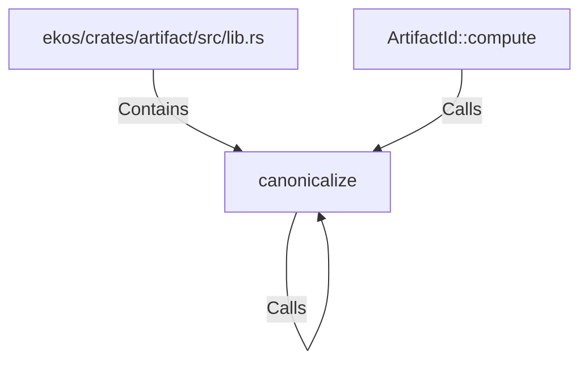

# canonicalize (RustSymbol)

## Properties

| Key | Value |
|---|---|
| `kind` | function |

## Relationships

### Calls

- ← ArtifactId::compute (`0e9e62a4-0100-53e3-bc58-f7c408482937`)
- → canonicalize (`08d35be0-096d-5e3c-94d4-424966d024d9`)

### Contains

- ← ekos/crates/artifact/src/lib.rs (`918532b1-7390-5128-8de5-faf4f7a91daf`)

## Diagram

## Evidence

_No evidence cited._
