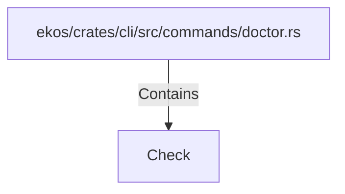

# Check (RustSymbol)

## Properties

| Key | Value |
|---|---|
| `kind` | struct |

## Relationships

### Contains

- ← ekos/crates/cli/src/commands/doctor.rs (`117003db-05ca-5009-9ea3-90c845aff5f4`)

## Diagram

## Evidence

_No evidence cited._
