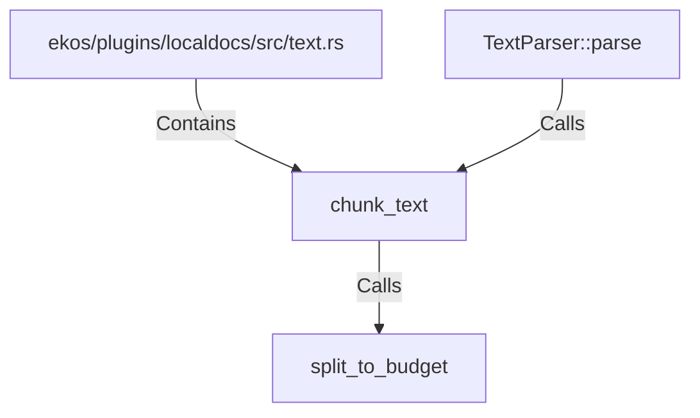

# chunk_text (RustSymbol)

## Properties

| Key | Value |
|---|---|
| `kind` | function |

## Relationships

### Calls

- ← TextParser::parse (`d8a4bbd2-9d47-53c2-8746-6e817d24d7f5`)
- → split_to_budget (`d4c45ee3-3c6e-5747-9943-a5b3df1108ee`)

### Contains

- ← ekos/plugins/localdocs/src/text.rs (`fb7cfbed-8381-5078-b9d6-bc8b68af4e7d`)

## Diagram

## Evidence

_No evidence cited._
