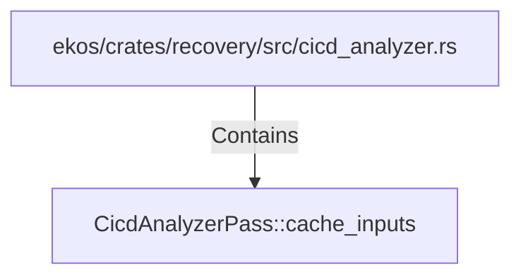

# CicdAnalyzerPass::cache_inputs (RustSymbol)

## Properties

| Key | Value |
|---|---|
| `kind` | method |

## Relationships

### Contains

- ← ekos/crates/recovery/src/cicd_analyzer.rs (`b6532a21-993c-5d28-8d99-891c30d70063`)

## Diagram

## Evidence

_No evidence cited._
