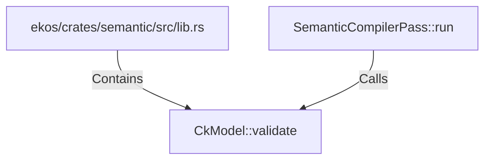

# CkModel::validate (RustSymbol)

## Properties

| Key | Value |
|---|---|
| `kind` | method |

## Relationships

### Calls

- ← SemanticCompilerPass::run (`c6428a28-088e-5899-b6d1-f734e97ebbbe`)

### Contains

- ← ekos/crates/semantic/src/lib.rs (`54021a72-4846-550c-960f-e63303e4d103`)

## Diagram

## Evidence

_No evidence cited._
