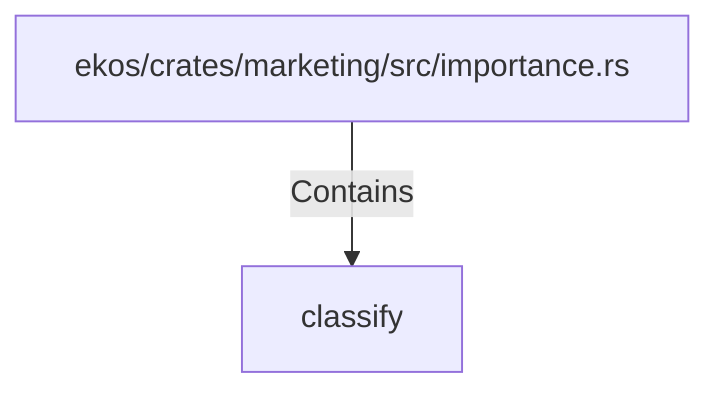

# classify (RustSymbol)

## Properties

| Key | Value |
|---|---|
| `kind` | function |

## Relationships

### Contains

- ← ekos/crates/marketing/src/importance.rs (`0660ec22-f9ab-533c-9a20-0b0ad28d9200`)

## Diagram

## Evidence

_No evidence cited._
