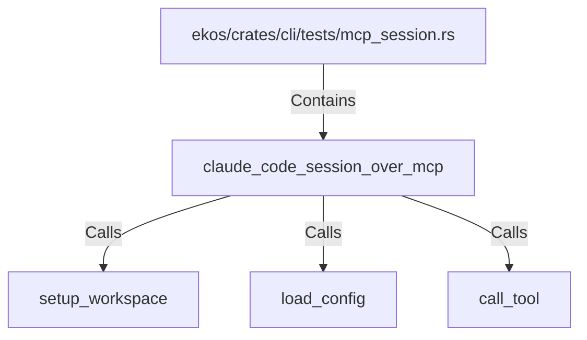

# claude_code_session_over_mcp (RustSymbol)

## Properties

| Key | Value |
|---|---|
| `kind` | function |

## Relationships

### Calls

- → setup_workspace (`60facea1-f085-5fb6-9750-725533dae17f`)
- → load_config (`467babc2-5a36-5968-88d4-8cd2204b2f95`)
- → call_tool (`79df7d9c-60b9-5b0c-82a0-8fea3e18a0a0`)

### Contains

- ← ekos/crates/cli/tests/mcp_session.rs (`201efc61-073b-5bcd-a5a8-a6c476333729`)

## Diagram

## Evidence

_No evidence cited._
