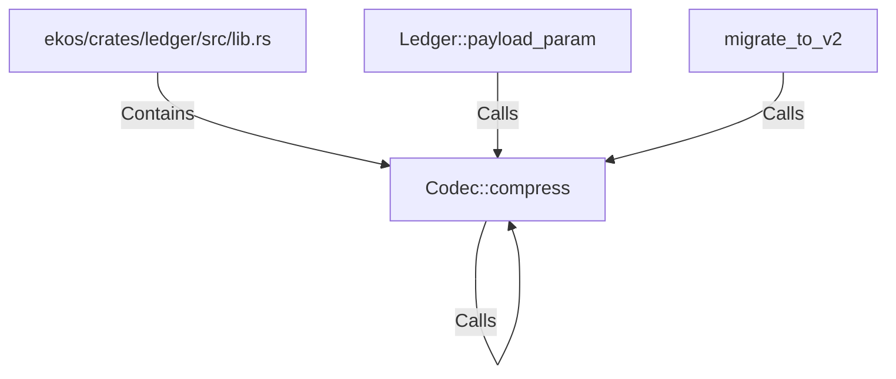

# Codec::compress (RustSymbol)

## Properties

| Key | Value |
|---|---|
| `kind` | method |

## Relationships

### Calls

- → Codec::compress (`599e1672-3536-58b3-8cc1-736e192923ad`)
- ← Ledger::payload_param (`d1e47b92-7f6e-559a-8f56-a2f6b571fd0d`)
- ← migrate_to_v2 (`fee5c44c-a2e1-59db-bf5d-b63aff20f8c9`)

### Contains

- ← ekos/crates/ledger/src/lib.rs (`21938f45-b767-5933-9e71-12e15ff53eb1`)

## Diagram

## Evidence

_No evidence cited._
