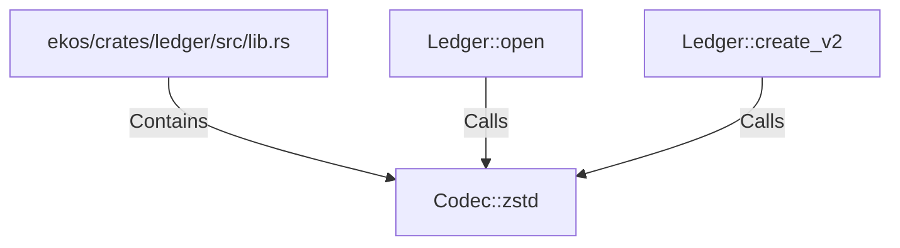

# Codec::zstd (RustSymbol)

## Properties

| Key | Value |
|---|---|
| `kind` | method |

## Relationships

### Calls

- ← Ledger::open (`1202f2b1-c8ed-5a89-aac3-5ef29891cb8b`)
- ← Ledger::create_v2 (`e0a15224-8267-58c6-9f12-b6f33a379ceb`)

### Contains

- ← ekos/crates/ledger/src/lib.rs (`21938f45-b767-5933-9e71-12e15ff53eb1`)

## Diagram

## Evidence

_No evidence cited._
