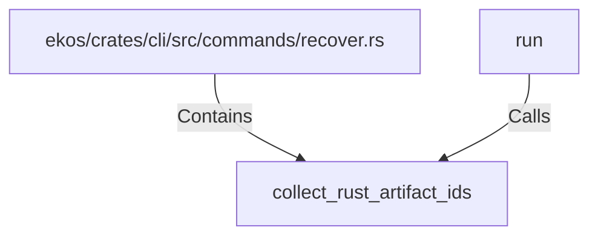

# collect_rust_artifact_ids (RustSymbol)

## Properties

| Key | Value |
|---|---|
| `kind` | function |

## Relationships

### Calls

- ← run (`786d5225-0ff9-5fff-99f9-2f5d73858f4a`)

### Contains

- ← ekos/crates/cli/src/commands/recover.rs (`7e02bcf9-a7b4-5099-8255-130d9ef401bb`)

## Diagram

## Evidence

_No evidence cited._
