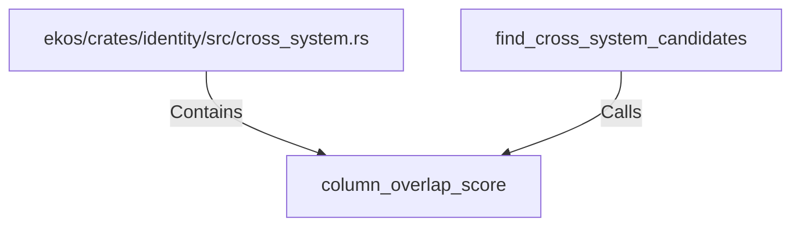

# column_overlap_score (RustSymbol)

## Properties

| Key | Value |
|---|---|
| `kind` | function |

## Relationships

### Calls

- ← find_cross_system_candidates (`9dd46d31-0b3f-54f2-9bc5-f4deee8ca431`)

### Contains

- ← ekos/crates/identity/src/cross_system.rs (`44d130a8-ca02-506d-bc1a-21b037fb492c`)

## Diagram

## Evidence

_No evidence cited._
