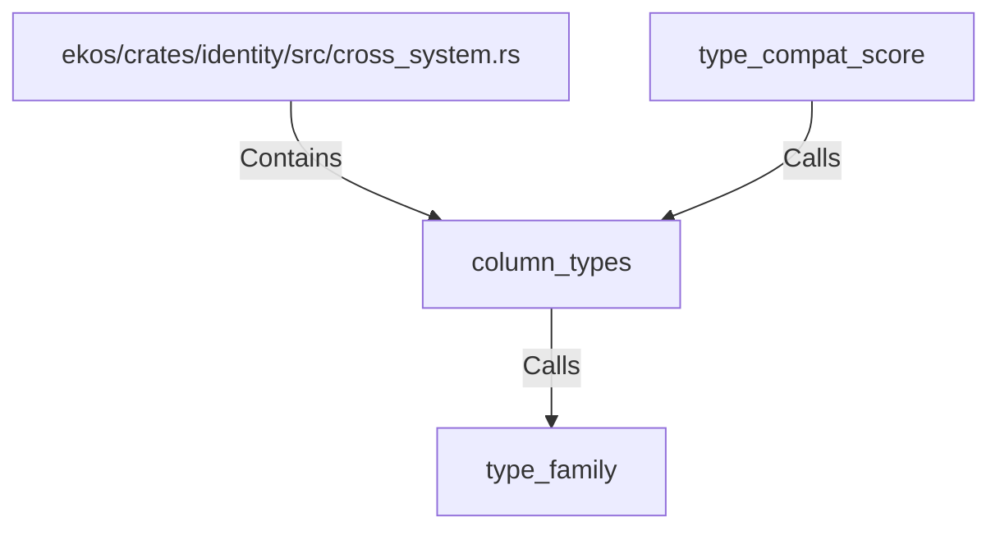

# column_types (RustSymbol)

## Properties

| Key | Value |
|---|---|
| `kind` | function |

## Relationships

### Calls

- → type_family (`49576809-e712-5bd4-91a2-edf1ee60a47d`)
- ← type_compat_score (`20571641-04cb-5dd0-846a-7cb921b2e2be`)

### Contains

- ← ekos/crates/identity/src/cross_system.rs (`44d130a8-ca02-506d-bc1a-21b037fb492c`)

## Diagram

## Evidence

_No evidence cited._
