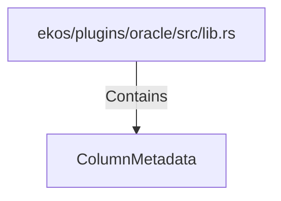

# ColumnMetadata (RustSymbol)

## Properties

| Key | Value |
|---|---|
| `kind` | struct |

## Relationships

### Contains

- ← ekos/plugins/oracle/src/lib.rs (`affbb6cf-64eb-5dd5-805d-01cf2bd08c7f`)

## Diagram

## Evidence

_No evidence cited._
