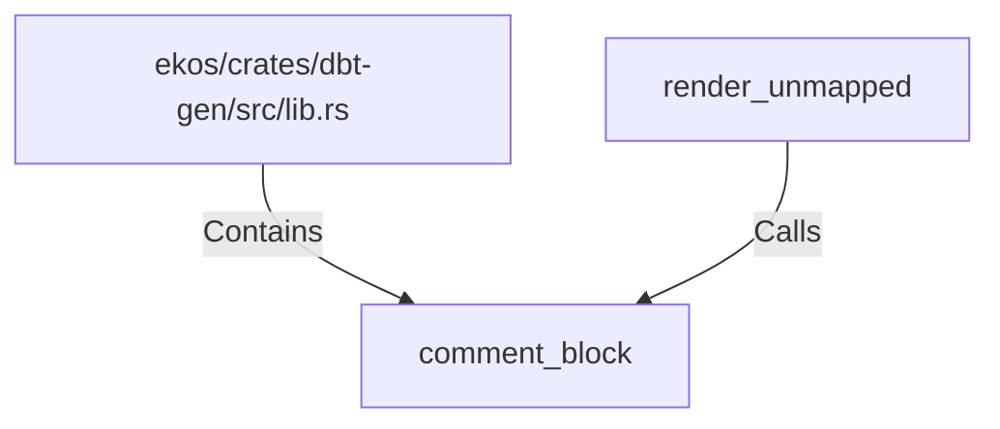

# comment_block (RustSymbol)

## Properties

| Key | Value |
|---|---|
| `kind` | function |

## Relationships

### Calls

- ← render_unmapped (`130a2e45-93d9-563f-b669-b7e6e8bd7900`)

### Contains

- ← ekos/crates/dbt-gen/src/lib.rs (`20d45ed0-c411-592d-8034-6486682f898c`)

## Diagram

## Evidence

_No evidence cited._
