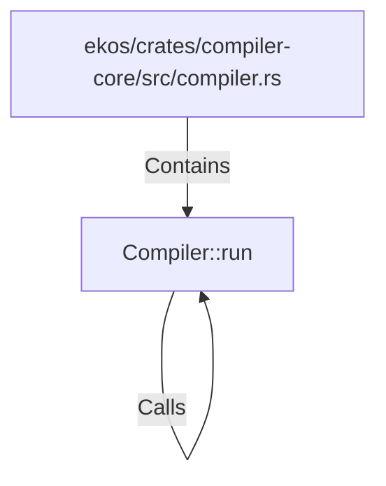

# Compiler::run (RustSymbol)

## Properties

| Key | Value |
|---|---|
| `kind` | method |

## Relationships

### Calls

- → Compiler::run (`e99254af-76a1-52b0-beee-dd8fa3c21077`)

### Contains

- ← ekos/crates/compiler-core/src/compiler.rs (`3b7209fe-32c4-588e-b8b5-5fa2165ff88b`)

## Diagram

## Evidence

_No evidence cited._
