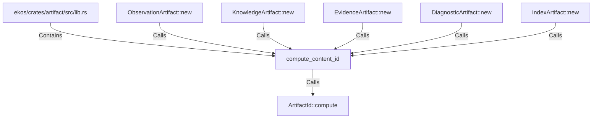

# compute_content_id (RustSymbol)

## Properties

| Key | Value |
|---|---|
| `kind` | function |

## Relationships

### Calls

- → ArtifactId::compute (`0e9e62a4-0100-53e3-bc58-f7c408482937`)
- ← ObservationArtifact::new (`d3b06dcb-6b00-578c-bb03-2ed93735d399`)
- ← KnowledgeArtifact::new (`6a696ea8-bbb4-57e2-8ac4-cd7e7cf5c452`)
- ← EvidenceArtifact::new (`4b6ad777-17f7-5a0d-9b47-e2a5fc581d02`)
- ← DiagnosticArtifact::new (`3529a593-008c-5745-a14d-524906d6cbd2`)
- ← IndexArtifact::new (`08ac6aa9-19bb-50b5-9291-fc045349dd29`)

### Contains

- ← ekos/crates/artifact/src/lib.rs (`918532b1-7390-5128-8de5-faf4f7a91daf`)

## Diagram

## Evidence

_No evidence cited._
