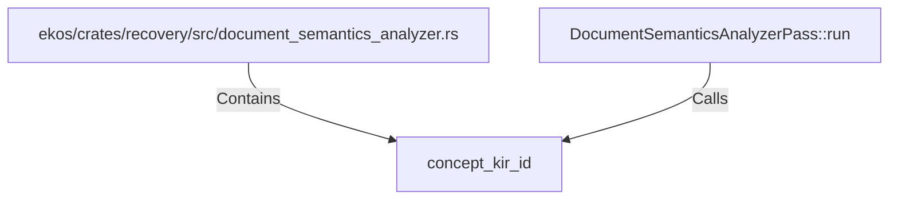

# concept_kir_id (RustSymbol)

## Properties

| Key | Value |
|---|---|
| `kind` | function |

## Relationships

### Calls

- ← DocumentSemanticsAnalyzerPass::run (`1f105b9f-acbe-584a-bbbd-f0af139b4dc0`)

### Contains

- ← ekos/crates/recovery/src/document_semantics_analyzer.rs (`62e92526-f096-5ed2-bc72-0bdae8703aa3`)

## Diagram

## Evidence

_No evidence cited._
