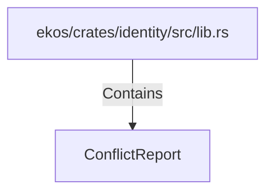

# ConflictReport (RustSymbol)

## Properties

| Key | Value |
|---|---|
| `kind` | struct |

## Relationships

### Contains

- ← ekos/crates/identity/src/lib.rs (`c958282a-6d42-50ab-9cf9-8533976f0820`)

## Diagram

## Evidence

_No evidence cited._
