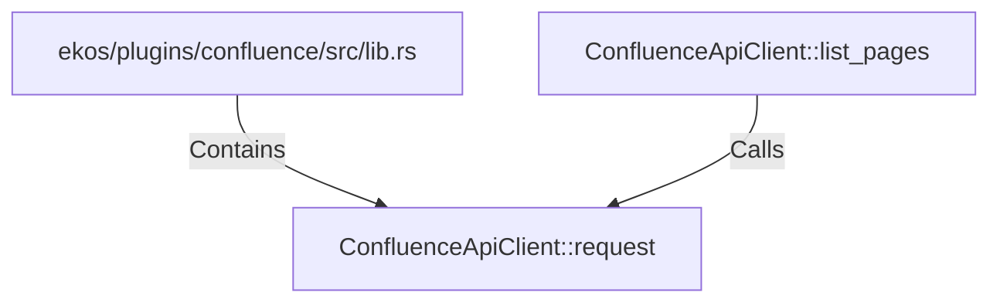

# ConfluenceApiClient::request (RustSymbol)

## Properties

| Key | Value |
|---|---|
| `kind` | method |

## Relationships

### Calls

- ← ConfluenceApiClient::list_pages (`f939f625-8621-5ed8-9b78-16519298b9a5`)

### Contains

- ← ekos/plugins/confluence/src/lib.rs (`b78f02e6-8e4d-58de-abb4-ed29b9688c5f`)

## Diagram

## Evidence

_No evidence cited._
