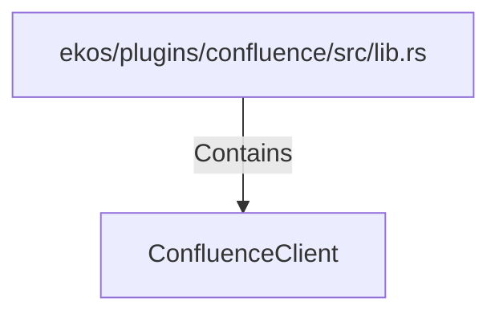

# ConfluenceClient (RustSymbol)

## Properties

| Key | Value |
|---|---|
| `kind` | trait |

## Relationships

### Contains

- ← ekos/plugins/confluence/src/lib.rs (`b78f02e6-8e4d-58de-abb4-ed29b9688c5f`)

## Diagram

## Evidence

_No evidence cited._
