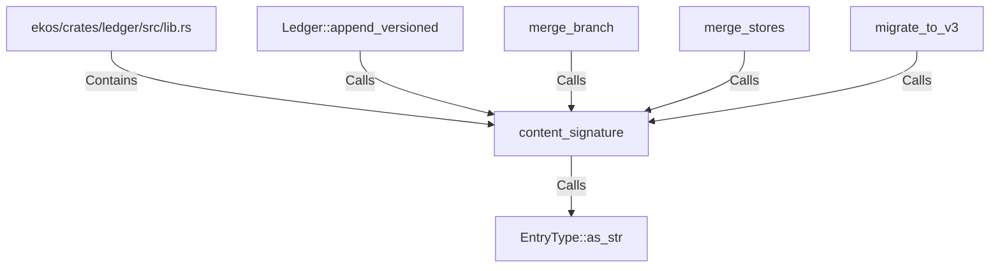

# content_signature (RustSymbol)

## Properties

| Key | Value |
|---|---|
| `kind` | function |

## Relationships

### Calls

- → EntryType::as_str (`0beb5b76-38f4-53a2-9ee4-e1070cca9822`)
- ← Ledger::append_versioned (`fd02b8da-192d-585b-a46d-996b4095186c`)
- ← merge_branch (`16be84c8-16f2-5d63-8dff-104f7296fc29`)
- ← merge_stores (`35e9663b-3b6d-50ec-ad16-9721c45eb3d1`)
- ← migrate_to_v3 (`1dab3f65-615b-56e9-ae9b-e92c32a2cb63`)

### Contains

- ← ekos/crates/ledger/src/lib.rs (`21938f45-b767-5933-9e71-12e15ff53eb1`)

## Diagram

## Evidence

_No evidence cited._
