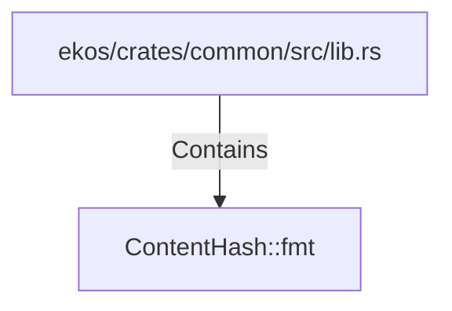

# ContentHash::fmt (RustSymbol)

## Properties

| Key | Value |
|---|---|
| `kind` | method |

## Relationships

### Contains

- ← ekos/crates/common/src/lib.rs (`baf41b7a-1ef7-5a05-9152-5eb0218f0896`)

## Diagram

## Evidence

_No evidence cited._
