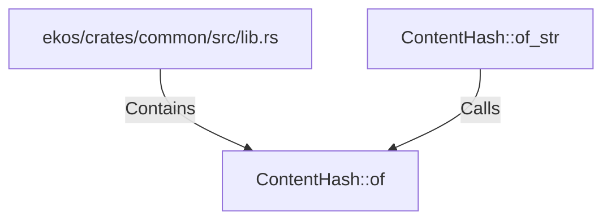

# ContentHash::of (RustSymbol)

## Properties

| Key | Value |
|---|---|
| `kind` | method |

## Relationships

### Calls

- ← ContentHash::of_str (`9b9fe50e-e94f-5ba1-ba80-9f24ca5b0d91`)

### Contains

- ← ekos/crates/common/src/lib.rs (`baf41b7a-1ef7-5a05-9152-5eb0218f0896`)

## Diagram

## Evidence

_No evidence cited._
