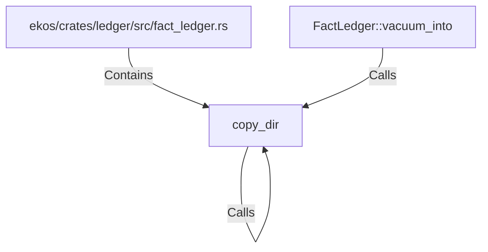

# copy_dir (RustSymbol)

## Properties

| Key | Value |
|---|---|
| `kind` | function |

## Relationships

### Calls

- ← FactLedger::vacuum_into (`15d6a903-48f1-5963-9aba-8ee50bcf8c6c`)
- → copy_dir (`3dcea5c3-8c02-5ccc-ac49-8f4903706db4`)

### Contains

- ← ekos/crates/ledger/src/fact_ledger.rs (`eadcb59e-818f-5d1e-af87-ff29aba11423`)

## Diagram

## Evidence

_No evidence cited._
