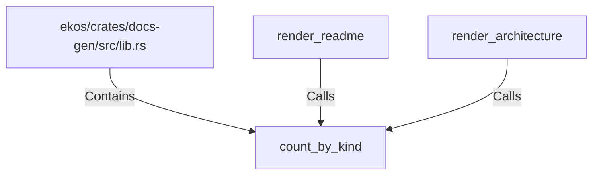

# count_by_kind (RustSymbol)

## Properties

| Key | Value |
|---|---|
| `kind` | function |

## Relationships

### Calls

- ← render_readme (`9d4791bb-1f18-5b60-a857-af29d99bffee`)
- ← render_architecture (`f75f757e-c643-5e43-b04b-48d13123d04b`)

### Contains

- ← ekos/crates/docs-gen/src/lib.rs (`6ca4fba0-18e5-59b7-9876-7dae72e2ce0e`)

## Diagram

## Evidence

_No evidence cited._
