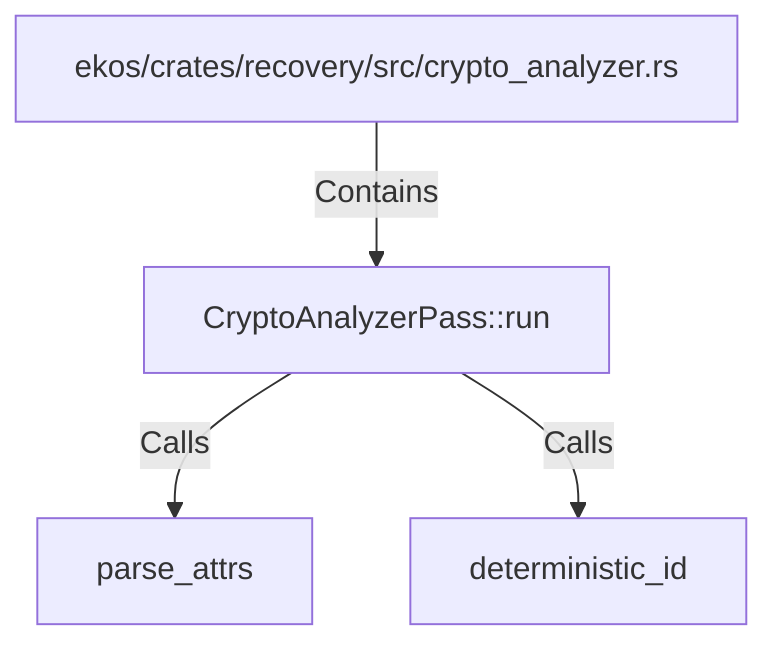

# CryptoAnalyzerPass::run (RustSymbol)

## Properties

| Key | Value |
|---|---|
| `kind` | method |

## Relationships

### Calls

- → parse_attrs (`5fedc248-e713-5749-865e-909f63819859`)
- → deterministic_id (`461c25e4-b57b-54cf-b1db-8a03eb01bbd5`)

### Contains

- ← ekos/crates/recovery/src/crypto_analyzer.rs (`c5652a0f-42a3-5e1c-82d4-0cf4d37fab34`)

## Diagram

## Evidence

_No evidence cited._
