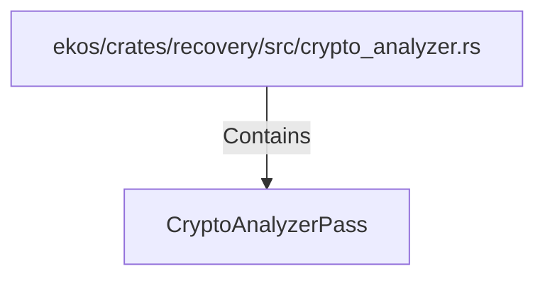

# CryptoAnalyzerPass (RustSymbol)

## Properties

| Key | Value |
|---|---|
| `kind` | struct |

## Relationships

### Contains

- ← ekos/crates/recovery/src/crypto_analyzer.rs (`c5652a0f-42a3-5e1c-82d4-0cf4d37fab34`)

## Diagram

## Evidence

_No evidence cited._
