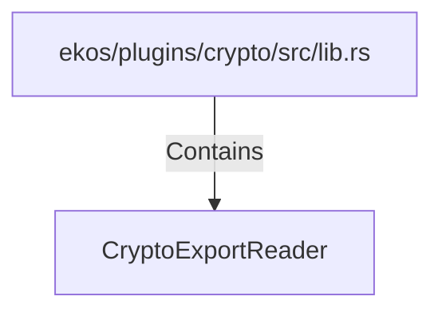

# CryptoExportReader (RustSymbol)

## Properties

| Key | Value |
|---|---|
| `kind` | trait |

## Relationships

### Contains

- ← ekos/plugins/crypto/src/lib.rs (`83728c61-df4d-5ad6-81c7-5bf50ff761fb`)

## Diagram

## Evidence

_No evidence cited._
