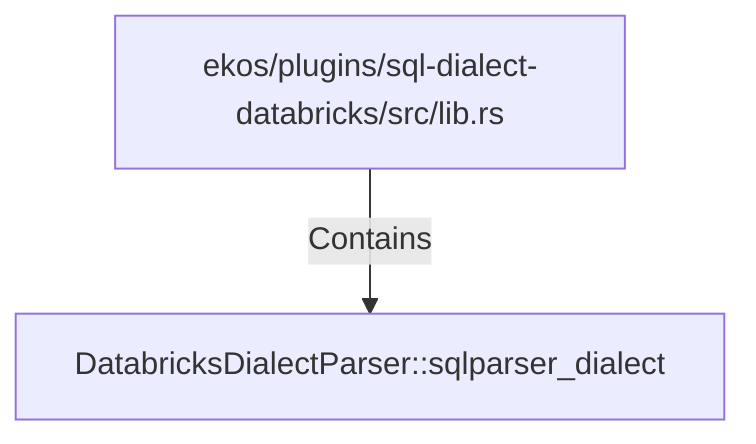

# DatabricksDialectParser::sqlparser_dialect (RustSymbol)

## Properties

| Key | Value |
|---|---|
| `kind` | method |

## Relationships

### Contains

- ← ekos/plugins/sql-dialect-databricks/src/lib.rs (`e03746a2-2ca7-57cf-abcf-b40da11fd1d4`)

## Diagram

## Evidence

_No evidence cited._
