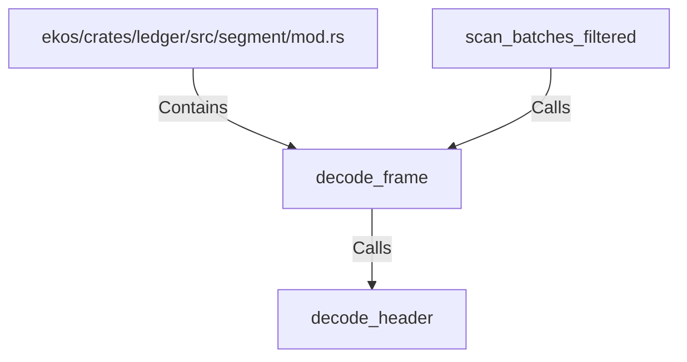

# decode_frame (RustSymbol)

## Properties

| Key | Value |
|---|---|
| `kind` | function |

## Relationships

### Calls

- ← scan_batches_filtered (`cefece15-35d7-567a-889d-48edf2ee6fe1`)
- → decode_header (`c0caddb8-2278-5f35-b313-f93159e56dbf`)

### Contains

- ← ekos/crates/ledger/src/segment/mod.rs (`80a64e0a-b0ac-51df-b3be-128cddd1cc83`)

## Diagram

## Evidence

_No evidence cited._
