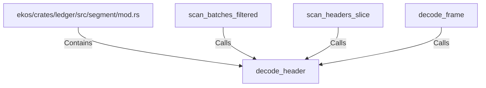

# decode_header (RustSymbol)

## Properties

| Key | Value |
|---|---|
| `kind` | function |

## Relationships

### Calls

- ← scan_batches_filtered (`cefece15-35d7-567a-889d-48edf2ee6fe1`)
- ← scan_headers_slice (`58cd3f37-9374-5ff9-aeea-9fef60615002`)
- ← decode_frame (`ac39fcb4-9dc0-595d-af9b-bce1eb69f50c`)

### Contains

- ← ekos/crates/ledger/src/segment/mod.rs (`80a64e0a-b0ac-51df-b3be-128cddd1cc83`)

## Diagram

## Evidence

_No evidence cited._
