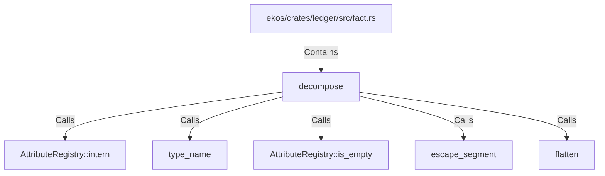

# decompose (RustSymbol)

## Properties

| Key | Value |
|---|---|
| `kind` | function |

## Relationships

### Calls

- → AttributeRegistry::intern (`1f29bac1-ffa9-5110-bbe2-6742ce05b657`)
- → type_name (`94c95a8b-e28c-584d-ba0f-e8212edd1910`)
- → AttributeRegistry::is_empty (`9cdd0396-a4a6-5ba7-b142-40240858e67e`)
- → escape_segment (`36efc953-06f8-55fd-8c9b-56ab9c679642`)
- → flatten (`bf6d717e-62f8-5503-b991-dc1cf3358b97`)

### Contains

- ← ekos/crates/ledger/src/fact.rs (`7837f9fa-7178-5151-a068-e75361336c37`)

## Diagram

## Evidence

_No evidence cited._
