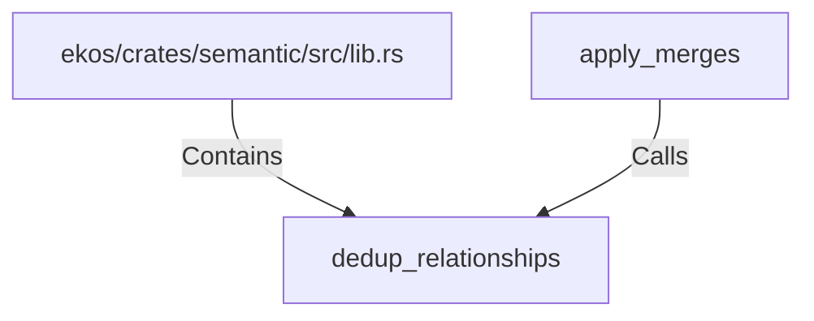

# dedup_relationships (RustSymbol)

## Properties

| Key | Value |
|---|---|
| `kind` | function |

## Relationships

### Calls

- ← apply_merges (`0fe2ab6b-10b6-50bf-be74-c6ec8ad47104`)

### Contains

- ← ekos/crates/semantic/src/lib.rs (`54021a72-4846-550c-960f-e63303e4d103`)

## Diagram

## Evidence

_No evidence cited._
