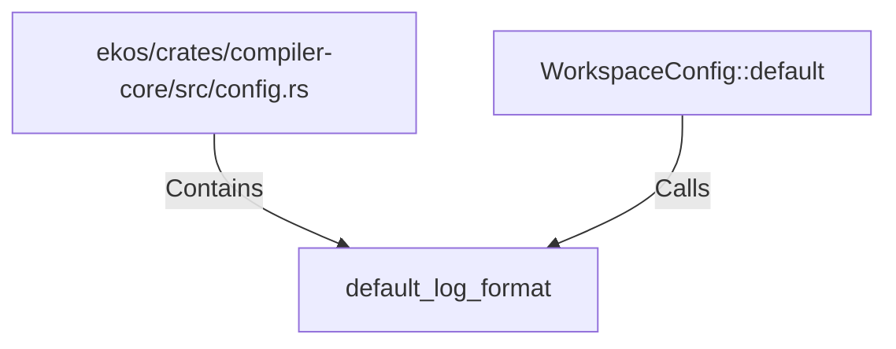

# default_log_format (RustSymbol)

## Properties

| Key | Value |
|---|---|
| `kind` | function |

## Relationships

### Calls

- ← WorkspaceConfig::default (`86487b2d-47d6-5105-807b-404b12767a95`)

### Contains

- ← ekos/crates/compiler-core/src/config.rs (`d0747f34-25e1-5426-80eb-a54fffcac598`)

## Diagram

## Evidence

_No evidence cited._
