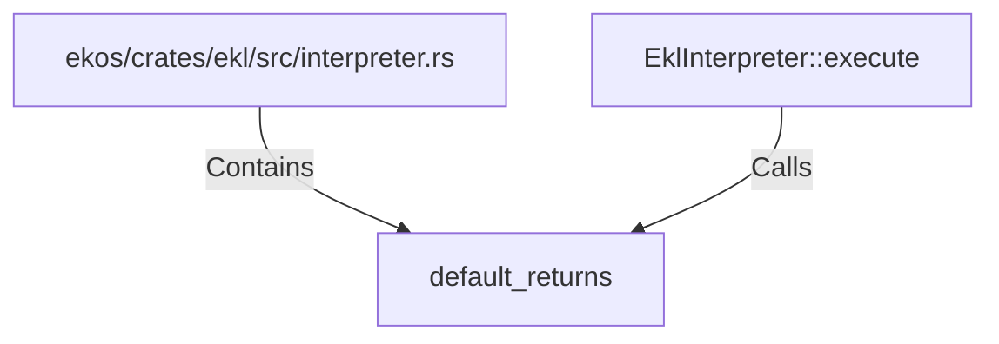

# default_returns (RustSymbol)

## Properties

| Key | Value |
|---|---|
| `kind` | function |

## Relationships

### Calls

- ← EklInterpreter::execute (`feb95d3d-5916-525d-86e3-ad4cee4ff906`)

### Contains

- ← ekos/crates/ekl/src/interpreter.rs (`9c2cb6e4-ee09-503f-8cf5-ccfaf23ecd79`)

## Diagram

## Evidence

_No evidence cited._
