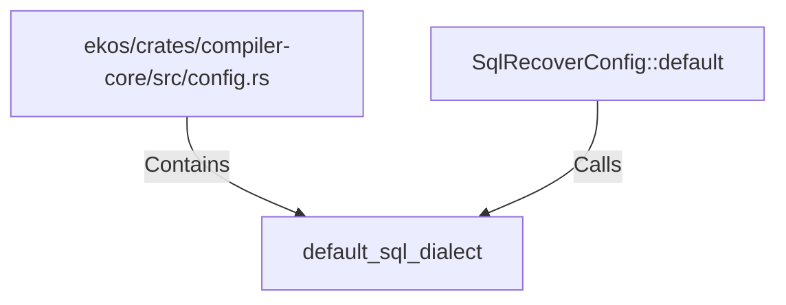

# default_sql_dialect (RustSymbol)

## Properties

| Key | Value |
|---|---|
| `kind` | function |

## Relationships

### Calls

- ← SqlRecoverConfig::default (`fe38f3be-a4fa-5373-ba20-1201a822e6d3`)

### Contains

- ← ekos/crates/compiler-core/src/config.rs (`d0747f34-25e1-5426-80eb-a54fffcac598`)

## Diagram

## Evidence

_No evidence cited._
