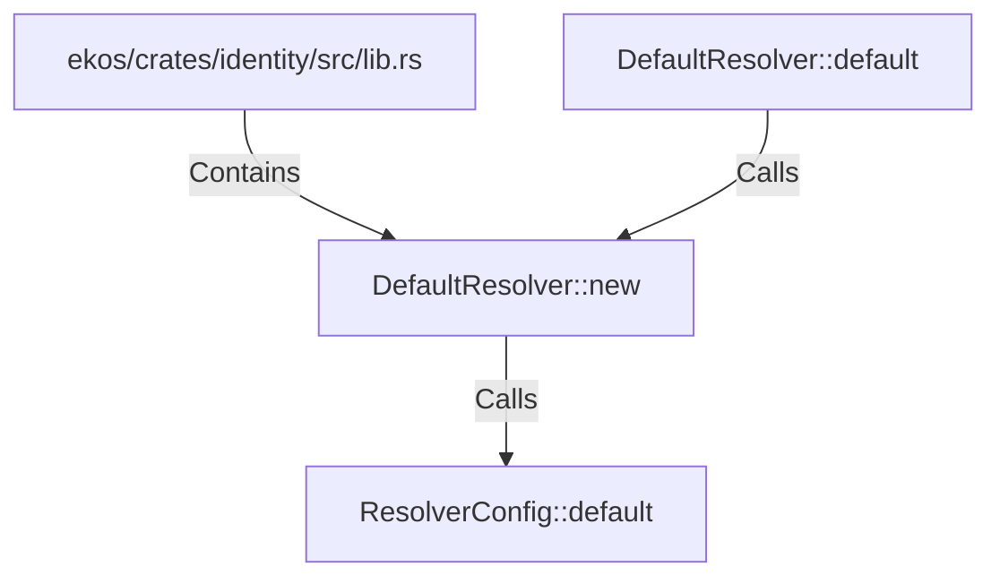

# DefaultResolver::new (RustSymbol)

## Properties

| Key | Value |
|---|---|
| `kind` | method |

## Relationships

### Calls

- ← DefaultResolver::default (`8ebf139e-19c9-5366-962e-629a07f4ba8a`)
- → ResolverConfig::default (`57f25bef-7b5c-5595-b59e-6f07dc10f99b`)

### Contains

- ← ekos/crates/identity/src/lib.rs (`c958282a-6d42-50ab-9cf9-8533976f0820`)

## Diagram

## Evidence

_No evidence cited._
