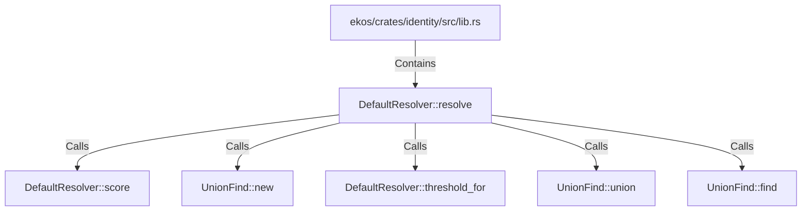

# DefaultResolver::resolve (RustSymbol)

## Properties

| Key | Value |
|---|---|
| `kind` | method |

## Relationships

### Calls

- → DefaultResolver::score (`babffd19-f871-53c0-80bd-ed8ef0920e33`)
- → UnionFind::new (`05a77ab3-acf0-5cc3-bd01-47e0d0e8d612`)
- → DefaultResolver::threshold_for (`49b695e3-042f-57e0-9d1a-f94a899ecc0b`)
- → UnionFind::union (`a78faae3-7f4c-5699-95bf-ef8c6cf855a5`)
- → UnionFind::find (`023832e4-adcc-5b45-b48d-5c2f435f0546`)

### Contains

- ← ekos/crates/identity/src/lib.rs (`c958282a-6d42-50ab-9cf9-8533976f0820`)

## Diagram

## Evidence

_No evidence cited._
