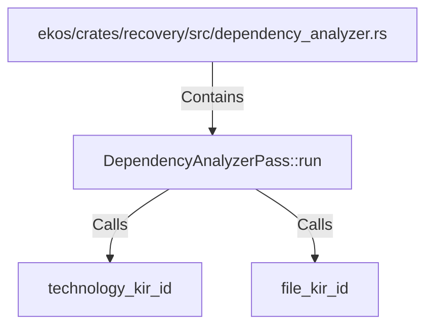

# DependencyAnalyzerPass::run (RustSymbol)

## Properties

| Key | Value |
|---|---|
| `kind` | method |

## Relationships

### Calls

- → technology_kir_id (`2f289a68-fd14-50db-8cd1-ff94ef4e8830`)
- → file_kir_id (`46f60f86-47a3-5b4f-b172-b0453ca7805c`)

### Contains

- ← ekos/crates/recovery/src/dependency_analyzer.rs (`9baa718a-d61d-554c-a791-7798003ba6c4`)

## Diagram

## Evidence

_No evidence cited._
