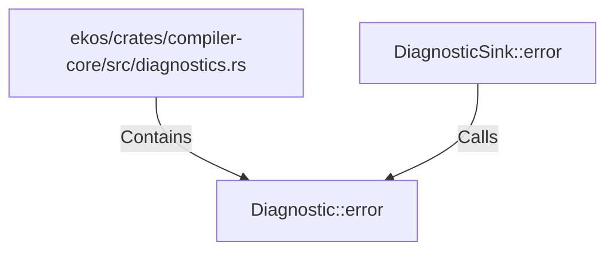

# Diagnostic::error (RustSymbol)

## Properties

| Key | Value |
|---|---|
| `kind` | method |

## Relationships

### Calls

- ← DiagnosticSink::error (`e6093eea-c3f9-5894-b146-d449ee5b6f84`)

### Contains

- ← ekos/crates/compiler-core/src/diagnostics.rs (`e5b5b2e0-3763-5cb8-a914-f113bb9e3ac4`)

## Diagram

## Evidence

_No evidence cited._
