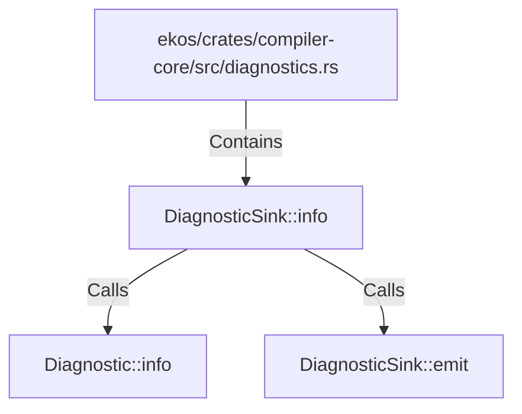

# DiagnosticSink::info (RustSymbol)

## Properties

| Key | Value |
|---|---|
| `kind` | method |

## Relationships

### Calls

- → Diagnostic::info (`50b0b84a-7b74-5f94-8378-42ae38261000`)
- → DiagnosticSink::emit (`ba8ffc80-3c11-5877-bbd3-a465cd305be4`)

### Contains

- ← ekos/crates/compiler-core/src/diagnostics.rs (`e5b5b2e0-3763-5cb8-a914-f113bb9e3ac4`)

## Diagram

## Evidence

_No evidence cited._
