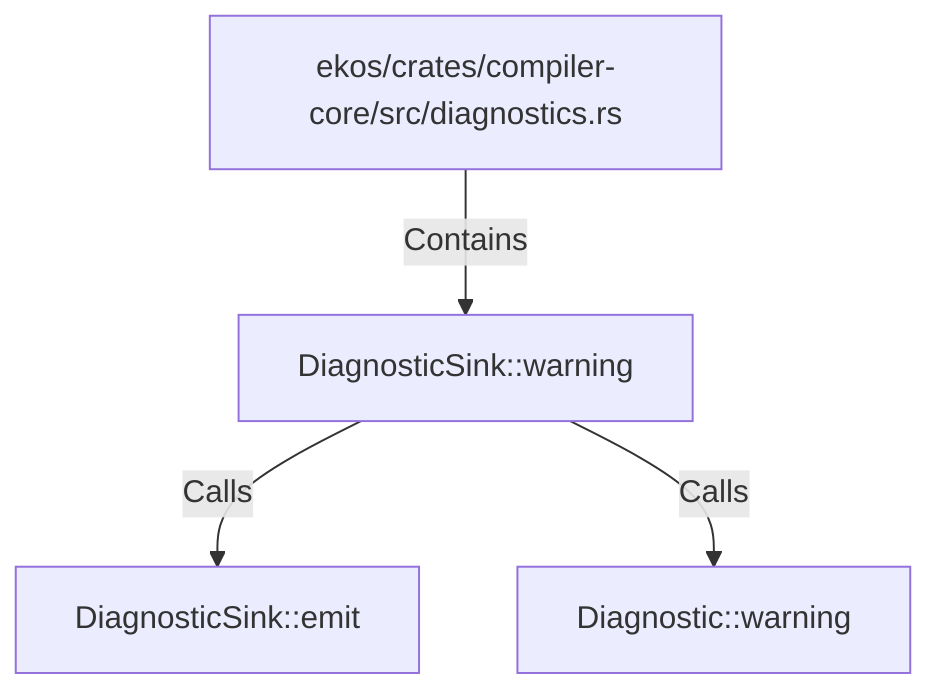

# DiagnosticSink::warning (RustSymbol)

## Properties

| Key | Value |
|---|---|
| `kind` | method |

## Relationships

### Calls

- → DiagnosticSink::emit (`ba8ffc80-3c11-5877-bbd3-a465cd305be4`)
- → Diagnostic::warning (`ef370595-8fee-58e2-9dfb-a62ab3481d89`)

### Contains

- ← ekos/crates/compiler-core/src/diagnostics.rs (`e5b5b2e0-3763-5cb8-a914-f113bb9e3ac4`)

## Diagram

## Evidence

_No evidence cited._
