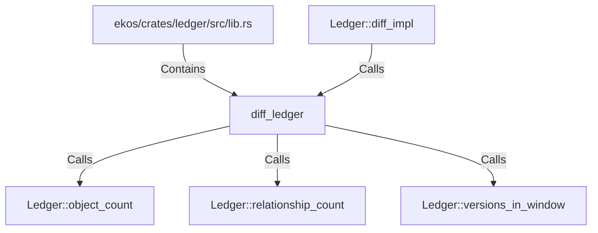

# diff_ledger (RustSymbol)

## Properties

| Key | Value |
|---|---|
| `kind` | function |

## Relationships

### Calls

- → Ledger::object_count (`f92c42cd-96e2-5b55-8bc1-2184a7ea22d5`)
- → Ledger::relationship_count (`fd2750d9-0510-5e05-ac77-f3125db298a6`)
- → Ledger::versions_in_window (`972c0223-2c64-54bc-b774-890fc6b61ab1`)
- ← Ledger::diff_impl (`ee9781b6-a015-5509-9d34-9aab6595bac6`)

### Contains

- ← ekos/crates/ledger/src/lib.rs (`21938f45-b767-5933-9e71-12e15ff53eb1`)

## Diagram

## Evidence

_No evidence cited._
