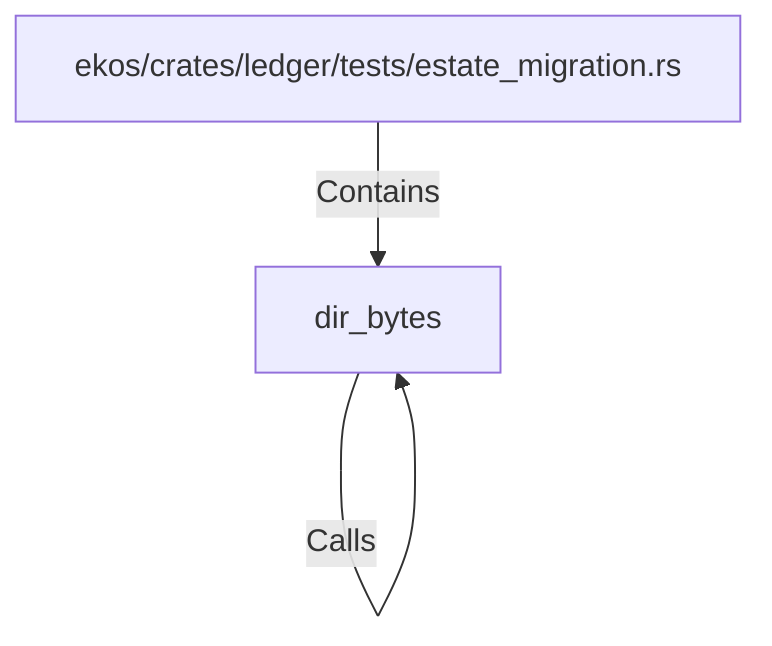

# dir_bytes (RustSymbol)

## Properties

| Key | Value |
|---|---|
| `kind` | function |

## Relationships

### Calls

- → dir_bytes (`a1c5e8ff-8c31-5c4f-8c69-fa74d6203a5c`)

### Contains

- ← ekos/crates/ledger/tests/estate_migration.rs (`ea07674a-8ab1-54ed-a18a-f016992a8c48`)

## Diagram

## Evidence

_No evidence cited._
